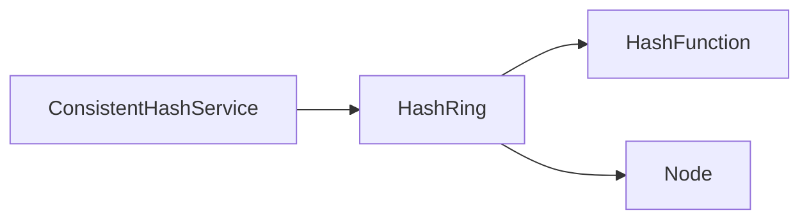

# Documento de Arquitectura y Diseño: Hashing Consistente

Este documento detalla la arquitectura, el diseño del dominio y los patrones de concurrencia aplicados en la implementación del clúster con Hashing Consistente.

---

## 1. Contexto y Objetivos del Sistema

El sistema distribuye la asignación de claves de datos (peticiones de usuarios, sesiones, caché) entre un conjunto variable de servidores físicos (nodos) de forma balanceada. 

### Objetivos Clave
*   **Balanceo Equitativo**: Evitar la concentración desproporcionada de datos en un solo servidor físico.
*   **Mínimo Impacto en Cambios de Topología**: Al agregar o remover servidores, solo se debe migrar una fracción equivalente a $1/N$ de las claves, donde $N$ es la cantidad de nodos físicos activos.
*   **Lectura Ultra Rápida**: Garantizar un ruteo de peticiones en tiempo logarítmico $O(\log V)$ (donde $V$ es el número de nodos virtuales) sin bloqueos de lectura que ralenticen los flujos calientes de la aplicación.

---

## 2. Decisiones de Arquitectura y Patrones de Diseño

El diseño sigue una estructura limpia dividida por responsabilidades claras.



### 2.1. Patrón Fachada (Facade)
El cliente interactúa únicamente con `ConsistentHashService`. Esta fachada encapsula toda la mecánica compleja de asignación del anillo lógico y el tratamiento de fallos, exponiendo operaciones limpias como `routeRequest` o `registerNode`.

### 2.2. Diseño de Dominio (Domain Model) e Inmutabilidad
*   **`Node` (Modelo de Entidad)**: Implementado como un `record` de Java. Esto garantiza inmutabilidad por diseño. Las entidades inmutables eliminan los efectos secundarios indeseados (side-effects) y son inherentemente seguras para su uso en entornos con múltiples hilos de ejecución.
*   **`HashRing` (Agregado de Dominio)**: Contiene la lógica pura del anillo de hashes. Es responsable de orquestar el mapa lógico y asegurar la consistencia interna ante alteraciones del clúster.

### 2.3. Patrón Copy-On-Write (Lectura Libre de Bloqueos)
En sistemas de producción distribuidos, el ruteo de peticiones es millones de veces más frecuente que las modificaciones en los servidores físicos (altas/bajas).
*   **El Problema**: El uso de bloqueos tradicionales de lectura/escritura (`ReentrantReadWriteLock`) introduce retrasos de CPU por la contención del estado interno del cerrojo.
*   **La Solución**: Declarar el `TreeMap` principal como una referencia `volatile`:
    ```java
    private volatile TreeMap<Long, Node> ring = new TreeMap<>();
    ```
*   **Mecánica**:
    *   **Lecturas (`getNode`)**: Se toma una referencia local del mapa en ese instante. Las búsquedas en el `TreeMap` se ejecutan concurrentemente a máxima velocidad sin adquirir ningún lock.
    *   **Escrituras (`addNode`/`removeNode`)**: Son métodos declarados como `synchronized` para evitar condiciones de carrera entre hilos de administración. Cada escritura clona el mapa actual, aplica las modificaciones sobre la copia y actualiza la referencia volátil (`this.ring = newRing`) de forma atómica.

---

## 3. Componentes Técnicos al Detalle

### 3.1. Hashing con MurmurHash3 (32-bit)
En lugar de hashes criptográficos pesados (MD5, SHA), el sistema utiliza una implementación directa de **MurmurHash3**.
*   **Desempeño**: Es un hash no criptográfico de alto rendimiento con excelente distribución estadística.
*   **Operación**: Convierte claves tipo `String` en representaciones binarias de 32 bits positivas (representadas en tipos `long` para evitar la colisión por signo negativo de Java).

### 3.2. Estructura de Datos del Anillo (`TreeMap`)
Para modelar el anillo lógico, la estructura idónea es un árbol binario de búsqueda balanceado (Rojo-Negro), provisto en Java por `TreeMap`.
*   Permite encontrar el servidor más cercano a un hash de datos en tiempo de $O(\log V)$ usando el método `tailMap()`.
*   Si el hash de la clave es superior al hash de cualquier nodo en el anillo, el método retorna un mapa vacío. En este caso se vuelve al primer elemento (`ring.firstKey()`), simulando geométricamente un anillo circular continuo.

### 3.3. Mitigación de Desbalanceo: Nodos Virtuales (Réplicas)
Si los nodos físicos se colocan directamente en el anillo, su distribución azarosa puede provocar que un nodo acapare grandes segmentos contiguos del círculo.
*   **Solución**: Se crean `virtualNodesCount` réplicas por cada nodo.
*   **Fórmula**: Al insertar el nodo físico `NodeA` con IP `10.0.0.1`, se generan claves como `10.0.0.1-V0`, `10.0.0.1-V1`, etc.
*   Cada réplica virtual genera un hash distinto y dispersa la presencia de `NodeA` en el círculo. Esto fragmenta el anillo en cientos de partes intercaladas con otros servidores, logrando un balance estadístico óptimo.

### 3.4. Principio de Contingencia (Graceful Degradation)
Para cumplir con la alta disponibilidad, si la topología del clúster está vacía, `ConsistentHashService` redirige el ruteo hacia un nodo de contingencia (`fallbackNode`). El flujo principal de peticiones no lanza excepciones inesperadas, aumentando la robustez ante desastres en la infraestructura.

---

## 4. Declaración de Uso de Herramientas de Asistencia (IA)

En alineación con las buenas prácticas de transparencia del proceso de evaluación, se declara el uso de asistentes basados en Inteligencia Artificial durante el desarrollo de este componente, bajo un enfoque de **co-diseño arquitectónico**:

* **Filosofía de Uso:** La herramienta no se utilizó para la generación automatizada de código de caja negra (*AI slop*). En su lugar, actuó como un *sparring partner* técnico para contrastar las estructuras de datos nativas de Java frente a los requisitos de concurrencia y los principios del libro *A Philosophy of Software Design* (APOSD).
* **Aportes Críticos en el Diseño:**
  1. **Estrategia Concurrente:** El diseño inicial contemplaba un esquema tradicional de exclusión mutua basado en bloqueos explícitos. Tras debatir el impacto de la contención en entornos de lectura masiva, se optó por la transición hacia el patrón **Copy-On-Write** acoplado a una referencia de tipo **`volatile`**.
  2. **Optimización de Bajo Nivel:** Se analizó el costo de CPU que introducen las funciones criptográficas nativas de Java como MD5. La asistencia de la IA fue clave para implementar de forma puramente artesanal el algoritmo **MurmurHash3 de 32 bits** mediante manipulación directa de bits, maximizando la velocidad de enrutamiento y garantizando la autonomía del código al prescindir de dependencias externas pesadas (como Google Guava).
* **Validación Humana:** Todo el código de producción, la suite de pruebas concurrentes de estrés en JUnit 5 y la gestión de la consistencia de memoria (JMM) fueron supervisados, auditados y corregidos manualmente para asegurar que el componente cumpla con los estándares de robustez industrial exigidos.
